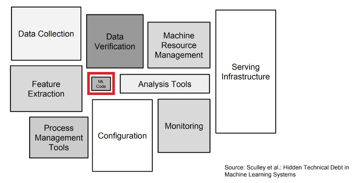
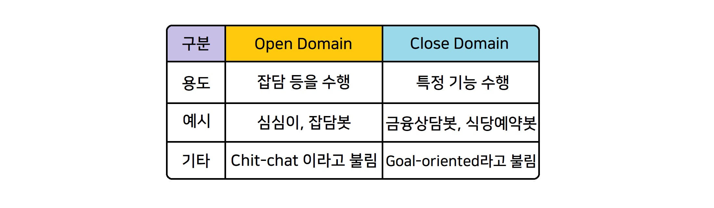
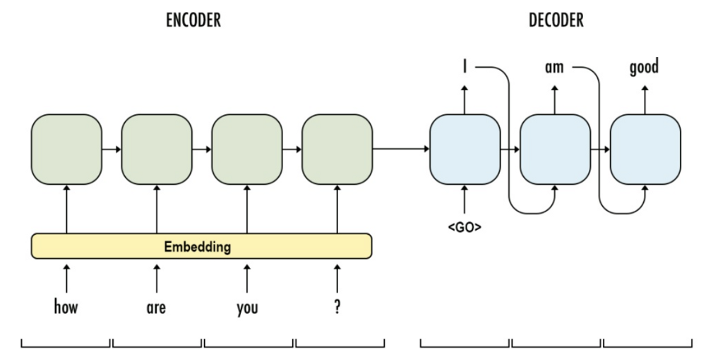
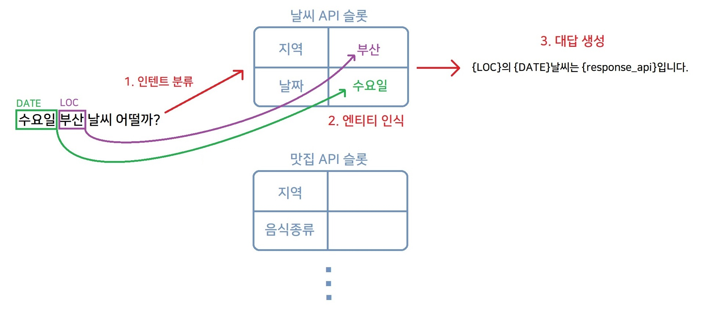
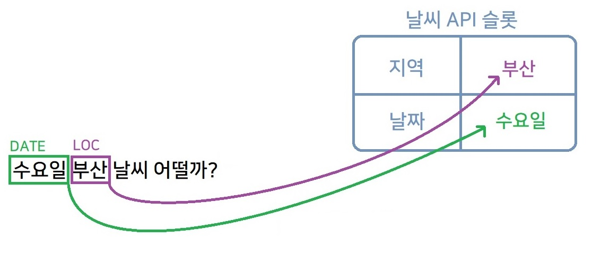
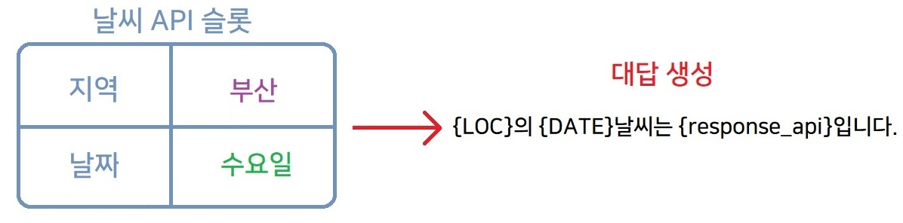
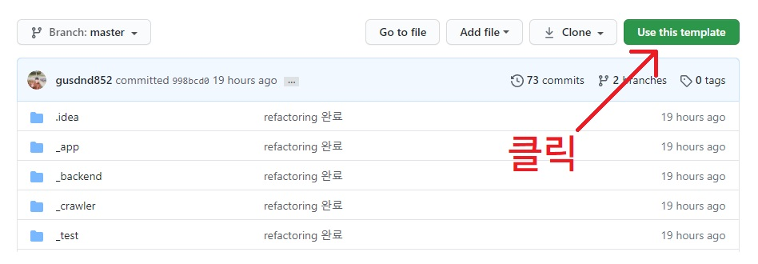
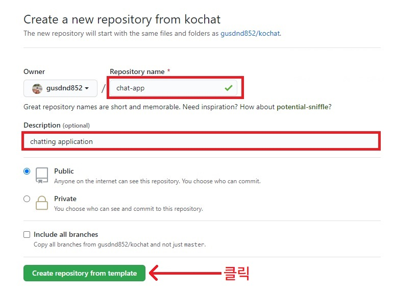
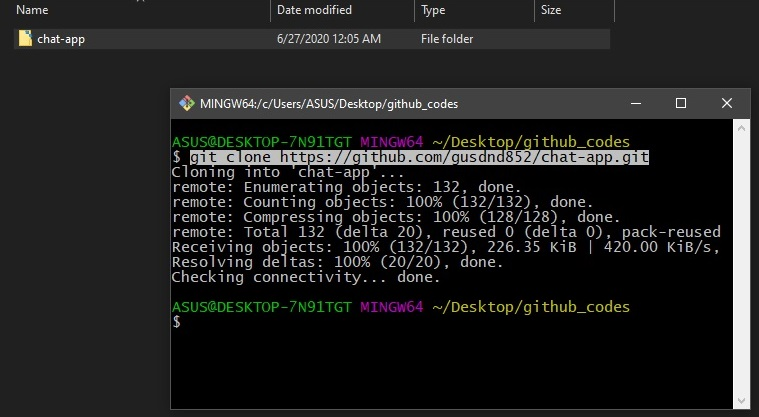

# Kochat (Korean Chatbot)

[](https://www.codefactor.io/repository/github/gusdnd852/kochat/overview/master)
[](https://codebeat.co/projects/github-com-gusdnd852-kochat-master)
[](https://github.com/dwyl/esta/issues)


<br>

## 목차

<br>

## 1. Kochat 이란?


**Kochat은 한국어 전용 챗봇 개발 프레임워크로, 머신러닝 개발자라면 
누구나 무료로 손쉽게 한국어 챗봇을 개발 할 수 있도록 돕는 오픈소스 프레임워크**입니다.
단순 Chit-chat이 아닌 사용자에게 여러 기능을 제공하는 상용화 레벨의 챗봇 개발은 
단일 모델만으로 개발되는 경우보다 다양한 데이터, configuration, ML모델, 
Restful Api 및 애플리케이션, 또 이들을 유기적으로 연결할 파이프라인을 갖추어야 하는데 
이 것을 처음부터 개발자가 스스로 구현하는 것은 굉장히 번거롭고 손이 많이 가는 작업입니다. 
실제로 챗봇 애플리케이션을 직접 구현하다보면 아래 그림처럼 실질적으로 모델 개발보다는 
이런 부분들에 훨씬 시간과 노력이 많이 필요합니다.
<br><br>



Kochat은 이러한 부분을 해결하기 위해 제작되었습니다. 
데이터 전처리, 아키텍처, 모델과의 파이프라인, 실험 결과 시각화, 성능평가 등은 
Kochat의 구성을 사용하면서 개발자가 원하는 모델이나 Loss함수, 데이터 셋 등만 
간단하게 작성하여 내가 원하는 모델의 성능을 빠르게 실험할 수 있게 도와줍니다.
또한 프리 빌트인 모델들과 Loss 함수등을 지원하여 딥러닝이나 자연어처리에 대해 잘 모르더라도 
프로젝트에 데이터만 추가하면 손쉽게 상당히 높은 성능의 챗봇을 개발할 수 있게 도와줍니다. 
아직은 초기레벨이기 때문에 많은 모델과 기능을 지원하지는 않지만 점차 모델과 기능을 늘려나갈 계획입니다.
<br><br><br>

### 1.1. 기존 챗봇 빌더와의 차이점
- 기존에 상용화된 많은 챗봇 빌더와 Kochat은 타깃으로 하는 사용자가 다릅니다.
상용화된 챗봇 빌더들은 매우 간편한 웹 기반의 UX/UI를 제공하며 일반인을 타깃으로 합니다.
그에 반해 **Kochat은 챗봇빌더 보다는 개발자를 타깃으로하는 프레임워크에 가깝습니다.**
개발자는 소스코드를 작성함에 따라서 프레임워크에 본인만의 모델을 추가할 수 있고, 
Loss 함수를 바꾸거나 본인이 원하면 아예 새로운 기능을 첨가할 수도 있습니다.

- **Kochat은 오픈소스 프로젝트입니다.** 따라서 많은 사람이 참여해서 함께 개발할 수 있고
만약 새로운 모델을 개발하거나 새로운 기능을 추가하고싶다면 얼마든지 레포지토리에 컨트리뷰션
할 수 있습니다.

- **Kochat은 무료입니다.** 매달 사용료를 내야하는 챗봇 빌더들에 비해 자체적인 서버만 가지고 있다면
비용제약 없이 얼마든지 챗봇을 개발하고 서비스 할 수 있습니다. 아직은 기능이 미약하지만 추후에는 정말 
웬만한 챗봇 빌더들 보다 더 다양한 기능을 무료로 제공할 예정입니다.
<br><br>

### 1.2. Kochat 제작 동기


이전에 여기저기서 코드를 긁어모아서 만든, 수준 낮은 제 딥러닝 chatbot 레포지토리가 
생각보다 큰 관심을 받으면서, 한국어로 된 딥러닝 챗봇 구현체가 정말 많이 없다는 것을 느꼈습니다. 
현재 대부분의 챗봇 빌더들은 대부분 일반인을 겨냥하기 때문에 웹상에서 손쉬운 UX/UI 
기반으로 서비스 중입니다. 일반인 사용자는 사용하기 편리하겠지만, 저와 같은 개발자들은 
모델도 커스터마이징 하고 싶고, 로스함수도 바꿔보고싶고, 시각화도 하면서 더욱 높은 성능을 
추구하고 싶지만 아쉽게도 한국어 챗봇 빌더 중에서 이러한 방식으로 잘 알려진 것은 없습니다. 
<br><br>

그러던 중, 미국의 [RASA](https://rasa.com)라는 챗봇 프레임워크를 보게 되었습니다. 
RASA는 개발자가 직접 소스코드를 수정할 수 있기 때문에 다양한 부분을 커스터마이징 할 수 있습니다. 
그러나 한국어를 제대로 지원하지 않아서, 전용 토크나이저를 추가하는 등 매우 번거로운 작업이 필요하고 
실제로 너무 다양한 컴포넌트가 존재하여 익숙해지는데 조금 어려운 편입니다. 
때문에 누군가 한국어 기반이면서 조금 더 컴팩트한 챗봇 프레임워크를 제작한다면 
챗봇을 개발해야하는 개발자들에게 정말 유용할 것이라고 생각되었고 직접 이러한 프레임워크를 
만들어보자는 생각에 Kochat을 제작하게 되었습니다. <br><br>

Kochat은 한국어(Korean)의 앞글자인 Ko와 제 이름 앞 글자인 Ko를 따와서 지었습니다.
Kochat은 앞으로도 계속 오픈소스 프로젝트로 유지될 것이며, 적어도 1~2달에 1번 이상은 새로운 모델을 추가하고, 
기존 소스코드의 버그를 수정하는 등 유지보수 작업을 이어갈 것이며 처음에는 미천한 실력인 제가 시작했지만,
그 끝은 RASA처럼 정말 유용하고 높은 성능을 보여주는 수준높은 오픈소스 프레임워크가 되었으면 좋겠습니다. :)

<br><br>


## 2. 챗봇에 대한 간략한 설명
이 챕터에서는 챗봇의 분류와 구현방법, Kochat은 어떻게 챗봇을 구현하고 있는지에 대해 간단하게 소개합니다. 
<br><br>

### 2.1. 챗봇의 분류



챗봇은 크게 비목적대화를 위한 Open domain 챗봇과 목적대화를 위한 Close domain 챗봇으로 나뉩니다.
Open domain 챗봇은 주로 잡담 등을 수행하는 챗봇을 의미하는데, 
여러분이 잘 알고있는 심심이 등이 챗봇이 대표적인 Open domain 챗봇이며 Chit-chat이라고도 불립니다.
Close domain 챗봇이란 한정된 대화 범위 안에서 사용자가 원하는 목적을 달성하기 위한 챗봇으로 
주로 피자 예약봇, 금융 상담봇 등이 이에 해당하며 Goal oriented 챗봇이라고도 불립니다. 
요즘 출시되는 시리나 빅스비 같은 인공지능 비서, 인공지능 스피커들은 특수 기능도 수행해야하고
사용자와 잡담도 잘 해야하므로 Open domain 챗봇과 Close domain 챗봇이 모두 포함되어 있는 경우가 많습니다.
<br><br>

### 2.2. 챗봇의 구현
챗봇을 구현하는 방법은 크게 통계기반의 챗봇과 딥러닝 기반의 챗봇으로 나뉩니다.
여기에서는 딥러닝 기반의 챗봇만 소개하도록 하겠습니다.
<br><br>
 
#### 2.2.1. Open domain 챗봇



먼저 Open domain 챗봇의 경우는 딥러닝 분야에서는 대부분, End to End 
신경망 기계번역 방식(Seq2Seq)으로 구현되어왔습니다. Seq2Seq은 한 문장을 다른 문장으로 
변환/번역하는 방식입니다. 번역기에게 "나는 배고프다"라는 입력이 주어지면 "I'm Hungry"라고 
번역해내듯이, 챗봇 Seq2Seq는 "나는 배고프다"라는 입력이 주어질 때, "많이 배고프신가요?" 등의 대답으로 번역합니다. 
최근에 발표된 Google의 [Meena](https://ai.googleblog.com/2020/01/towards-conversational-agent-that-can.html)
같은 모델을 보면, 복잡한 모델 아키텍처나 학습 프레임워크 없이 End to End (Seq2Seq) 모델만으로도
매우 방대한 데이터셋과 높은 성능의 컴퓨팅 리소스를 활용하면 정말 사람과 근접한 수준으로 대화할 수 있다는 것으로 알려져있습니다.
(그러나 현재버전 프레임워크에서는 Close domain 만 지원합니다. 
차후 버전에서 다양한 Seq2Seq 모델도 추가할 예정입니다.)
<br><br>

#### 2.2.2. Close domain 챗봇



Close domain 챗봇은 대부분 Slot Filling 방식으로 구현되어 왔습니다. 물론 Close domain 챗봇도
Open domain처럼 End to end로 구현하려는 [다양한](https://arxiv.org/pdf/1605.07683.pdf) 
[시도](https://arxiv.org/pdf/1702.03274.pdf) [들도](https://arxiv.org/pdf/1708.05956.pdf) 
[존재](https://arxiv.org/pdf/1804.08217.pdf) 하였으나, 논문에서 제시하는 
데이터셋에서만 잘 작동하고, 실제 다른 데이터 셋(Task6의 DSTC dataset)에 적용하면 그 정도의 
성능이 나오지 않았기 때문에 현업에 적용되기는 어려움이 있습니다. 때문에 현재는 대부분의 목적지향 
챗봇 애플리케이션이 기존 방식인 Slot Filling 방식으로 구현되고 있습니다.
<br><br>

Slot Filling 방식은 미리 기능을 수행할 정보를 담는 '슬롯'을 먼저 정의한 다음,
사용자의 말을 듣고 어떤 슬롯을 선택할지 정하고, 해당 슬롯을 채워나가는 방식입니다.
그리고 이러한 Slot Filling 방식 챗봇의 구현을 위해 '인텐트'와 '엔티티'라는 개념이 등장합니다.
말로만 설명하면 어려우니 예시를 봅시다. 가장 먼저 우리가 여행 정보 알림 챗봇을 만든다고 가정하고,
여행정보 제공을 위해 "날씨 정보제공", "미세먼지 정보제공", "맛집 정보제공", "여행지 정보제공"이라는 4가지 
핵심 기능을 구현해야한다고 합시다. 
<br><br>

#### 2.2.2.1. 인텐트(의도) 분류하기 : 슬롯 고르기


가장 먼저 사용자에게 문장을 입력받았을 때, 우리는 저 4가지 정보제공 기능 중
어떤 기능을 실행해야하는지 알아채야합니다. 이 것을 인텐트(Intent)분류. 즉, 의도 분류라고 합니다.
사용자로부터 "수요일 부산 날씨 어떠니?"라는 문장이 입력되면 4가지 기능 중  날씨 정보제공 기능을 
수행해야 한다는 것을 알아내야합니다. 때문에 문장 벡터가 입력되면, Text Classification을 수행하여
어떤 API를 사용해야할지 알아냅니다.
<br><br>

#### 2.2.2.2. 엔티티(개체명) 인식하기



그 다음 해야할 일은 바로 개체명인식 (Named Entity Recognition)입니다.
어떤 API를 호출할지 알아냈다면, 이제 그 API를 호출하기 위한 파라미터를 찾아야합니다.
만약 날씨 API의 실행을 위한 파라미터가 "지역"과 "날씨"라면 사용자의 입력 문장에서 "지역"에 관련된 정보와
"날씨"에 관련된 정보를 찾아내서 해당 슬롯을 채웁니다. 만약 사용자가 "수요일 날씨 알려줘"라고만 말했다면,
지역에 관련된 정보는 아직 찾아내지 못했기 때문에 다시 되물어서 찾아내야합니다. 
<br><br>

#### 2.2.2.3. 대답 생성하기



슬롯이 모두 채워졌다면 API를 실행시켜서 외부로부터 정보를 제공받습니다.
API로부터 결과가 도착하면, 미리 만들어둔 템플릿 문장에 해당 실행 결과를 삽입하여 대답을 만들어내고,
이 대답을 사용자에게 response합니다.
<br><br>

Slot Filling 방식의 챗봇은 위와 같은 흐름으로 진행됩니다. 따라서 이러한 방식의 챗봇을 구현하려면
최소한 3가지의 모듈이 필요합니다. 첫번째로 인텐트 분류모델, 엔티티 인식모델, 그리고 대답 생성모듈입니다.
Kochat은 이 세가지 모듈과 이를 서빙할 Restful API까지 모두 포함하고 있습니다. 
이에 대해서는 "4. 컴포넌트 및 아키텍처" 챕터에서 각각 모델을 어떻게 구현했는지 자세히 설명합니다.
<br><br>

## 3. Kochat 시작하기
우선 초기버전 코드는 Kochat 프레임워크 자체가 프레임워크로서 설계된 것이 아니라 정확하게 잘 돌아가는지에 
초점을 맞춘 상태이기 때문에 템플릿 레포지토리로 제공하는 것이 저한테도 편리하고 프레임워크를 사용하는 
쪽에서도 편리할 것이라고 판단하였습니다. (configuraion, 파일 경로 등등 처음부터 잡으려면 시간이 많이 
들고 오류도 굉장히 잦을 것으로 판단되기 때문에..) 우선 지금은 템플릿 레포지토리로 제공하고, 
추후에 기회가 되면 pip 형식으로도 제공하도록 하겠습니다.
<br><br>

### 3.1. 템플릿 레포지토리 만들기



상단의 Use this template 버튼을 클릭하여 템플릿 레포지토리를 생성합니다.
<br><br>



레포지토리 이름과 설명 등의 정보를 기입한 뒤, 레포지토리를 생성합니다.
<br><br>



git clone 명령어를 사용해서 방금 만든 레포지토리를 clone합니다.
<br><br>

### 3.3. 개발환경 설정하기

#### 3.3.1. Docker (Recommend)
이 프로젝트는 전용 도커 이미지를 지원합니다. <br>

```shell script
sudo docker pull gusdnd852/kochat:latest
```
위의 명령어로 도커이미지를 내려받을 수 있습니다. 
만약 도커를 사용하신다면 도커 이미지를 활용해서 개발환경을 원터치로 세팅하는 것을 추천드립니다.
pytorch버전은 가장 자주 쓰이는 10.1을 사용했는데, 만약 cuda 10.1 이하의 gpu를 사용하신다면 
requirements.txt에 있는 pytorch 디펜던시를 수정하시고 루트 경로에 있는 도커파일을 기반으로 
이미지를 새로 빌드하셔서 사용하시면 됩니다.
<br><br>

#### 3.3.2. PIP로 직접 다운로드
이 프로젝트는 pytorch, sklearn, gensim, flask, konlpy 등 다양한 디펜던시가 필요합니다.
필요한 디펜던시는 모두 requirements.txt에 정의해두었으니 확인하시고 다운로드 받으면 됩니다.
```shell script
pip install requiremnets.txt
```
pytorch버전은 가장 자주 쓰이는 10.1을 사용했는데, 만약 cuda 10.1 이하의 gpu를 사용하신다면 
requirements.txt에 있는 pytorch 디펜던시를 수정하시고 다운로드 받으시면 됩니다.
<br><br>


### 3.3. configuration 설정하기
`_backed`패키지의 `config.py`에 데이터/모델 저장 경로 등 다양한 설정 값들이 있습니다.
레포지토리를 열고 나서 가장 먼저 초기 설정 (운영체제와 루트 경로)를 해줘야합니다.

```python
# 1. OS는 'Windows' 혹은 'Others'를 적어주세요
# 이는 delimeter 설정을 위해서 입니다. ('/' vs '\\')

OS = 'Others' 
# OS = 'Windows'
```

OS를 설정했으면 다음 설정을 이어나갑니다.

```python
# 2. root_dir은 본인의 프로젝트 루트 경로를 적습니다. 
# 구분자로 {_}를 사용하고, 맨 끝에는 붙이지 않습니다.

root_dir = "/home{_}gusdnd852{_}Github{_}kochat"
# root_dir = 'C:'

# windows 예시 : "C:{_}yourdirectory{_}yourdirectory{_}..." (C 뒤에 ':'을 꼭 붙여주세요)
# linux/mac 예시 : "/home{_}yourdirectory{_}yourdirectory{_}..." (home 앞에 '/'를 꼭 붙여주세요)
```
기본 configuration 설정은 모두 끝났습니다. 기본 설정 말고도 아래에 훨씬 많은 설정들이 있기 때문에
주석을 잘 보시고 원하는 부분의 설정값을 변경하셔서 사용하시길 바랍니다.
<br><br>


### 3.4. 데이터셋 삽입하기
이제 만들려는 챗봇의 데이터를 삽입합니다. 데이터는 `_backend/data/raw`폴더에 삽입합니다. 
그 전에 데이터셋의 포맷을 먼저 살펴봅시다. 우리는 Intent와 Entity 데이터 셋이 필요합니다.
그러나 이 두가지 데이터 셋을 따로 만들려면 상당히 번거로울 것입니다. Kochat은 여러개로 분할된 
Entity 데이터셋을 하나의 파일로 합쳐서 Intent 데이터셋을 자동으로 생성합니다.
이 때 intent명은 파일명이 됩니다. 이렇게 하면 한가지 포맷만으로 인텐트와 엔티티 모두 커버 가능합니다.
말로만 설명하면 어려우니 예시 데이터셋을 보겠습니다.

```
dust.csv

question,label
서울 다음 주 먼지 알려줄래요,S-LOCATION B-DATE E-DATE O O
부안 먼지 어떻게 돼,S-LOCATION O O O
토요일 서천 공기 상태 좀 알려줄수 있니,S-DATE S-LOCATION O O O O O
월요일 공기상태 알려줄수 있어,S-DATE O O O
이번 주 가로수길 공기 알려줄래,B-DATE E-DATE S-LOCATION O O
구암 다음 주 공기 알려줘,S-LOCATION B-DATE E-DATE O O
이번 주 영등포 공기 말해줘,B-DATE E-DATE S-LOCATION O O
구로 다음 주 공기 알려줄래,S-LOCATION B-DATE E-DATE O O
마스크 챙겨야하나 모르겠네,O O O
...
```
```
restaurant.csv

question,label
짭짤한 빵 맛집 알려줘,S-LOCATION S-RESTAURANT O O
인기 많은 팥빵 빵집 추천 좀 해줄래,O O S-RESTAURANT O O O O
대천 괜찮은 밀면 코스요리 알려주겠니,S-LOCATION O S-RESTAURANT O O
창원 티비 나왔던 코스요리 추천,S-LOCATION O O O O
강원도 텔레비전 나왔었던 칼국수 코스요리 어디더라,S-LOCATION O O S-RESTAURANT O O
광주 요즘 괜찮은 바베큐 먹고싶어 배고파,S-LOCATION O O S-RESTAURANT O O
대구 주변 태국 음식 원조 식당 어디,S-LOCATION O S-RESTAURANT O O O O
서울 베트남 음식 먹고싶어 배고파,S-LOCATION S-RESTAURANT O O O
대전 인기 많은 돈가스 코스요리 어디니,S-LOCATION O O S-RESTAURANT O O
유명한 창원 브라우니 카페,O S-LOCATION S-RESTAURANT O
...
```

위와 같이 각 인텐트에 대한 질문들과 그에 대한 엔티티들을 작성합니다. 
이 때, 맨 윗줄에 컬럼명을 반드시 적어야하는데 문장의 경우는 
컬럼명을 `question`, entity의 경우는 컬럼명을 `label`로 만들어야 합니다.
question에서 각 단어, label에서 각 엔티티는 띄어쓰기로 구분해서 작성합니다.
예시 데이터셋에서는 엔티티 라벨은 BIO 스키마를 확장한 [BIOES](https://arxiv.org/pdf/1806.04470.pdf) 
스키마를 사용하여 작성하였습니다. 그러나 Entity 스키마는 어떠한 방식을 사용하셔도 무방합니다. 
config에서 정의할 수 있습니다. 참고로 엔티티(개체명) 인식에 익숙하지 않으시다면 [여기](https://keep-steady.tistory.com/20) 를
참고하시면 좋습니다. 데이터셋 구성의 핵심은 각 엔티티 데이터셋을 Intent에 따라 다른 파일로 분리해서 만들어야한다는 것입니다. 
이 파일을 기준으로 Kochat은 아래와 같은 두가지 통합 데이터셋을 자동으로 생성합니다.
<br><br>

```
intent_data.csv

question,intent
날씨 알려주겠니,weather
날씨 정보 알려주세요,weather
그 때 기온 어떨까,weather
그 때 기온 좋으려나,weather
...
부안 일요일 마스크 필요하니,dust
내일 옥천 마스크 필요할까,dust
영광 마스크 챙겨야하나 모르겠네,dust
...
전라도 광주 미술관 구경거리 부탁해,travel
서울 유명한 꽃놀이 정보,travel
서울 가까운 바다 구경거리 추천해 봐,travel
...
유명한 창원 브라우니 카페,restaurant
마카롱 카페 달콤한 머랭쿠키,restaurant
머랭쿠키 잘하는 무한리필 있니,restaurant
...
```
```
entity_data.csv

question,entity
날씨 알려주겠니,O O
날씨 정보 알려주세요,O O O
그 때 기온 어떨까,O O O O
...
유명한 꽃놀이 정보 알려주세요,O S-TRAVEL O O
유명한 에버랜드 볼거리 있어,O S-TRAVEL O O
추천할만한 축구 볼거리 있어,O S-TRAVEL O O
...
좋은 꽃게탕 식당 어디니,O S-RESTAURANT O O
좋은 근처 짜글이 먹고싶어 배고파,O O S-RESTAURANT O O
맛좋은 돼지고기 짜글이 어디,O B-RESTAURANT E-RESTAURANT O
...
제주 많이 공기 상태 나쁠까,S-LOCATION O O O O
먼지 너무 많이 없나,O O O O
혹시 목요일 먼지 심하니 마스크 챙길까,O S-DATE O O O O
```
이 두가지 데이터셋을 이용하여 인텐트 분류기와 엔티티 인식기를 학습합니다. 
그리고 추가로 입력할 수 있는 또 하나의 데이터 셋이 있는데 그 것은 바로 OOD 데이터셋입니다.
OOD 데이터셋은 `_backend/data/ood`에 추가합니다. OOD란 Out of distribution 데이터셋으로
아래처럼 4가지 인텐트 외의 데이터를 말합니다. 
<br><br>

```
question,intent
정치적 요즘 이슈 최근 알려줘,뉴스이슈
요즘 이슈 알려줘,뉴스이슈
요즘 사회적인 이슈 알려줘,뉴스이슈
최근 이슈 알려줘,뉴스이슈
알바하기 너무 힘들다,잡담
세상에 쉬운 일은 없어,잡담
알바하는데 같이 일하는 사람 좋아,잡담
알아들은 척했는데 모르겠어,잡담
엔플라잉 옥탑방 노래 틀어줘요,음악
재키와이 노래 들을래요,음악
백재범 노래 들을래요,음악
비 노래 깡 듣고 싶다,음악
```


OOD 데이터셋이 없어도 챗봇의 동작에는 문제가 없지만, OOD데이터셋이 있으면 
설정에 있어서 매우 번거로운 부분을 몇부분 자동화 시킬 수 있습니다. 
이에 대한 자세한 내용은 "4. 아키텍처와 컴포넌트"에서 자세히 후술합니다.
(OOD 데이터셋은 그렇게까지 많지 않아도 됩니다. 
예시의 경우도 총 3000라인의 데이터 중 600줄 정도만 만들어도 잘 작동합니다.)

 
<br><br>

## 4. 아키텍처와 컴포넌트
작성 예정.. (UML 다이어그램 및 도식도 첨가하기)
<br><br>

## 5. 사용법

## 5. 실험 및 시각화

## 6. 컨트리뷰터

#### 7.2. TODO (앞으로 할 일)
- [ ] 간단한 웹 인터페이스 기반 데모 페이지 제작하기
- [x] 엔티티 학습에 CRF 및 로스 마스킹 추가하기 
- [ ] Transformer 기반 모델 추가 (한국어 BERT, GPT2)
- [ ] Jupyter Note Example 작성하기 + Binder 실행 환경
- [ ] 다양한 Seq2Seq 모델을 추가해서 Fallback시 대처할 수 있게 만들기
- [ ] 대화 흐름관리를 위한 Story기능 논문 조사하고 구현하기
- [ ] 크롤러 패키지의 개발을 자동화 할 방법 찾아보기 (중요)
<br><br>

## 7. 라이센스
```
Copyright 2020 Kochat.

Licensed under the Apache License, Version 2.0 (the "License");
you may not use this file except in compliance with the License.
You may obtain a copy of the License at

http://www.apache.org/licenses/LICENSE-2.0

Unless required by applicable law or agreed to in writing, software
distributed under the License is distributed on an "AS IS" BASIS,
WITHOUT WARRANTIES OR CONDITIONS OF ANY KIND, either express or implied.
See the License for the specific language governing permissions and
limitations under the License.
```
